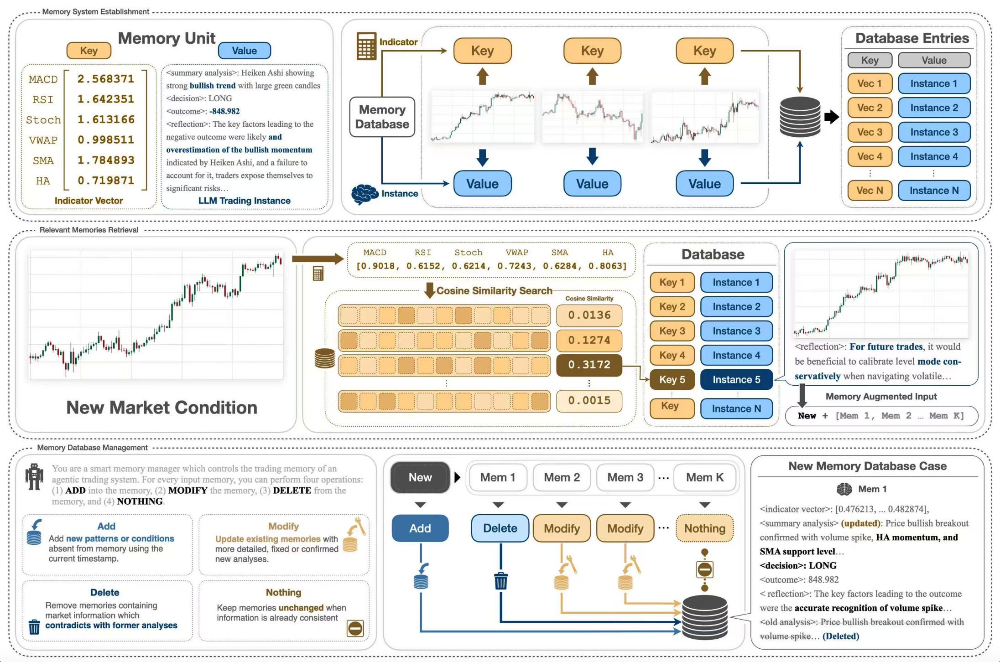
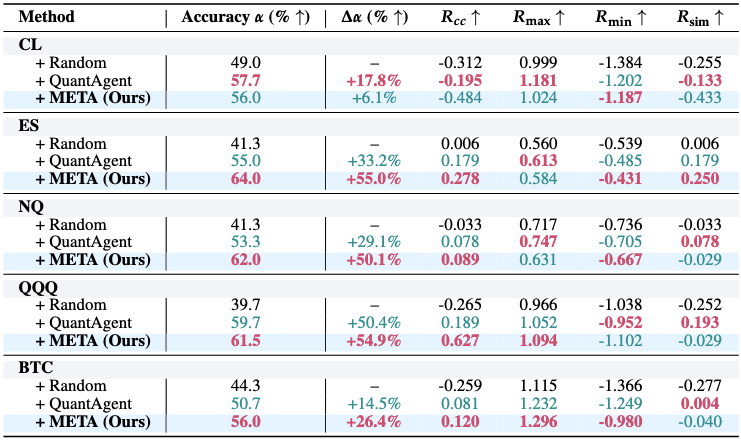

# Memory-Enhanced Trading Agent

Memory Enhanced Trading Agent performs technical analysis, retrieves similar historical experiences, decides LONG/SHORT, evaluates a future outcome, reflects, and consolidates the experience into an episodic memory store.


.png)

META integrates three core operators: Perception, Synthesis, and Memory. Specialized signal agents analyze current market conditions, while the decision agent combines their reports with historical experiences retrieved through cosine similarity over concatenated OHLCV and technical-indicator vectors. Each experience records market conditions, analysis, decisions, outcomes, and reflections. Post-trade reflection guides the addition, revision, removal, or retention of memories, enabling past lessons to inform future decisions.



META is evaluated against QuantAgent and a random trading baseline across five assets: CL, ES, NQ, QQQ, and BTC. It achieves the highest directional accuracy on four of five assets, reaching 64.0% on ES and 62.0% on NQ, improvements of 9.0 and 8.7 percentage points over QuantAgent. Return-based results vary across assets and metrics, highlighting both the benefits and limitations of memory-enhanced decision-making.


## Quick start

Use Python 3.11 or 3.12. From this directory:

```bash
python -m venv .venv
source .venv/bin/activate
python -m pip install -r requirements.txt
python run_graph.py --csv examples/synthetic_ohlcv.csv --output runs/demo --offline --steps 2
```

The offline mode uses deterministic LLM responses **but runs the real LangGraph, TA-Lib indicators, chart tools, retrieval, outcome simulation, reflection plumbing, and JSONL memory updates**. Its output measures software behavior, not model accuracy. The included data is synthetic.

For real LLM analysis, set `OPENAI_API_KEY` in your environment and omit `--offline`:

```bash
python run_graph.py --csv /path/to/market.csv --output runs/experiment_01 \
  --symbol BTC --time-frame 4h --window 90 --horizon 3 --steps 5
```

Each step makes multiple model requests. The default models match the surviving configuration: `gpt-4o-mini` for chart-tool requests and `gpt-4o` for analysis, decisions, reflection, and memory management. Accounts must have access to these models. Provider-backed requests were not exercised during reconstruction.

Canonical CSV columns are `Datetime,Open,High,Low,Close,Volume` (aliases are supported), with strictly increasing unique timestamps, positive prices and volume, and valid candles. Timestamps are converted to UTC; timezone-naive inputs are treated as UTC. The `--time-frame` label describes the input and does not resample it. At least `window + horizon` rows are required. Window >= 70 allows the retained indicator warmups and 30-point retrieval segments.

Always use a new/empty output directory. A memory database is created for that run and asset; the CLI deliberately does not resume or reuse existing databases.

## Evaluate a complete benchmark folder

Keep your existing `benchmark/btc/BTC_4h_1.csv` layout. Run every CSV in BTC with:

```bash
python run_graph.py \
  --benchmark-dir /Users/krisxu/Desktop/QuantAgent-main/benchmark/btc \
  --output runs/btc_benchmark
```

The default asset label is BTC (from the folder name); candle interval is inferred from filenames such as `BTC_4h_1.csv`. Use `--symbol` or `--time-frame` to override those labels if needed. Files with unrecognized interval names require `--time-frame`. Mixed intervals within one asset folder are rejected.

Run selected assets from the root:

```bash
python run_graph.py \
  --benchmark-root /Users/krisxu/Desktop/QuantAgent-main/benchmark \
  --assets btc cl es nq qqq \
  --output runs/meta_benchmarks
```

Omit `--assets` to discover all immediate asset subfolders containing CSV files, including dji, gc, and spx. An asset name is a dataset label, so these additional folders work without hard-coded stock mappings.

For a quick local check, add `--offline --steps 2`. `--steps` limits the earliest timestamp-sorted samples **per asset**; omit it to process the entire folder. Live mode requires `OPENAI_API_KEY` and uses real API calls.

Folder mode makes **one decision per CSV** using every row except the final `--horizon` rows (default 3). A 100-row sample therefore supplies 97 observed and 3 future candles. `--window` is only accepted in single-CSV mode. Samples need at least 70 observed candles; inconsistent files stop validation before model requests begin. This is a flat folder scan, not recursive discovery of scenario subfolders.

Samples are sorted by decision timestamp, not numeric filename. Each asset has its own memory database. When sample windows overlap, a pending outcome is consolidated only when its timestamp is at or before the next decision timestamp. Remaining outcomes are consolidated after the last prediction. Duplicate decision timestamps are allowed; memory identifiers include the sample filename. Future reflection text remains isolated from other predictions until consolidation.

Outputs are under `runs/meta_benchmarks/btc/`, `cl/`, etc. Each asset contains:

- `manifest.json`: actual sample order, source file, interval, and split timestamps.
- `predictions.jsonl`: immediate prediction records; delayed memory stats remain null here.
- `memory_events.jsonl`: consolidation events in outcome-availability order.
- `results.jsonl` and `results.csv`: final per-sample results with memory statistics.
- `memories.jsonl`, `charts/<sample-name>/`, `config.json`, and `summary.json`.

A root `summary.json` collects per-asset summaries. Memory counts in final sample rows refer to that sample's consolidation event, not necessarily its prediction time. Runs require a fresh output directory; failures retain completed prediction/event logs but do not support automatic resume.

CSV headers now accept case-insensitive OHLCV names and `Datetime`, `timestamp`, `time`, or `date`. Numeric timestamp columns are interpreted as Unix seconds or milliseconds. Rows still must be in strictly increasing chronological order.

## Workflow

1. **Perception:** the indicator agent computes numeric indicators. Pattern, trend, Bollinger Bands, anchored VWAP, SMA, stochastic, Fibonacci, Heiken Ashi, RSI, and MACD agents generate and analyze charts sequentially.
2. **Recall:** the decision agent concatenates 15 normalized indicator series with five normalized OHLCV series. Each series has 30 values, yielding a 600-dimensional key. Cosine similarity retrieves at most five memories at similarity >= 0.7.
3. **Synthesis:** the original decision prompt combines current reports and retrieved analysis, action, outcome, and reflection to produce a structured LONG/SHORT decision.
4. **Outcome and reflection:** a configurable future close evaluates the decision; the original reflection prompt summarizes lessons.
5. **Consolidation:** the memory agent asks the LLM to ADD, UPDATE, DELETE, or retain memories. The first experience is inserted directly. Updates are validated and saved atomically as JSONL.

The additional agents follow the supplied VWAP structure: tool selection -> chart generation -> vision-model analysis -> report/image state fields. A shared helper avoids duplicating that mechanism. A standalone VWAP agent is included, but remains inactive in the default graph, matching the supplied setup; anchored VWAP is active.

## Evaluation timing

A decision uses observations through close `t`; entry is that close, and exit is close `t + horizon`. Reflection and memory updates occur only after that exit is observable. The next decision occurs at `t + horizon`, so no intervening prediction sees an unavailable outcome. Defaults are window 90 and horizon 3. Incomplete final horizons are skipped.

For independent benchmark CSV samples, use the folder mode described above; its split and deferred-memory schedule replace the sliding-window schedule.

This is a close-to-close directional research simulation. P&L is a raw price difference with LONG/SHORT sign; signed returns divide by entry price. It does not execute orders, model transaction costs, use the suggested stops/targets, or implement a portfolio backtester. `risk_reward_ratio` remains an explanatory decision field.

## Configuration

Supply a JSON file using `--config`:

```json
{
  "agent_llm_model": "gpt-4o-mini",
  "graph_llm_model": "gpt-4o",
  "memory_config": {
    "top_k": 5,
    "similarity_threshold": 0.7,
    "max_memories": 10000,
    "normalize_vectors": false,
    "embedding_model": "text-embedding-3-small"
  }
}
```

CLI `--horizon` and `--mode` determine those two settings. Per-series z-score normalization is retained; constant series become zeros. `normalize_vectors` optionally adds feature standardization across stored memories, as in the supplied prototype. It defaults to false to avoid making scores depend on the changing memory population. Zero-norm keys do not match.

`--mode semantic` uses embeddings of the complete sorted collection of current analysis reports, compared with the stored reports. It requires embedding API access and uses the same top-k/threshold controls. The embedding model and text assembly are reconstruction choices, not recovered experiment settings. Semantic mode has offline unit coverage with an injected embedding provider; the CLI's `--offline` path is indicator-only.

## Outputs

- `config.json`: resolved model/memory settings and run identity.
- `results.jsonl`: reports, decision, outcome, reflection, retrieval counts, and memory actions per step.
- `memories.jsonl`: vector, reports, action, outcome, reflection, and metadata for each retained episode.
- `charts/step_00000/`: charts generated from that step's observed window.
- `summary.json`: number of steps, positive-P&L fraction, and mean signed return.

Memory metadata records the symbol, timeframe, outcome-availability timestamp, horizon, and decision analysis. Images are saved separately and are not duplicated into memory JSONL. JSONL load failures are explicit; corrupt stores are never silently reset. The store assumes a single writer.

## Programmatic use

```python
from trading_graph import TradingGraph

engine = TradingGraph()
result = engine.invoke({
    "kline_data": observed_window,       # dict of observed OHLCV lists
    "orig_kline_data": window_and_future, # same prefix + exactly horizon future candles
    "time_frame": "4h",
    "stock_name": "BTC",
    "memory_file": "/absolute/path/to/memories.jsonl"
})
```

`engine.invoke` injects configuration and empty messages. The underlying `engine.graph.invoke` remains available but requires a fully initialized state. Custom callers are responsible for chronological, same-asset memory use; the CLI enforces a fresh run and advances only after outcomes mature. To analyze an arbitrary CSV safely, prefer the CLI.

## Verification

```bash
python -m unittest discover -s tests -v
```

Tests cover cosine retrieval, thresholding, vector dimensions, semantic routing, JSONL roundtrips, reflection retention, transactional validation, memory capacity, complete horizons, a two-step graph run with actual charts, and the standalone VWAP agent.

`requirements.txt` pins the direct dependencies used for verification. `requirements-lock.txt` records the installed dependency closure for these packages. TA-Lib's Python wheels include the native library on supported platforms; unsupported platforms may need a separate TA-Lib installation.

## Source history and publication

See [docs/RECONSTRUCTION.md](docs/RECONSTRUCTION.md) for recovered versus reconstructed components and intentional fixes. Upstream project: [Y-Research-SBU/QuantAgent](https://github.com/Y-Research-SBU/QuantAgent). Original supplied README files and source hashes are preserved under `provenance/`.

No new software license has been assigned in this reconstruction. Retain the upstream license/attribution applicable to your source revision and choose the release license before publishing. This package is prepared for repository review; no GitHub repository has been created or published.
